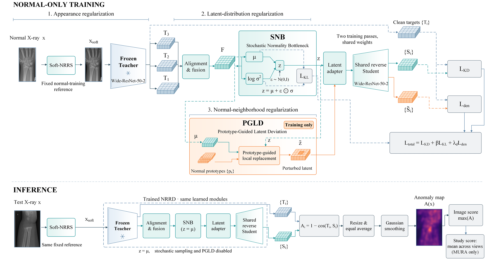

# NRRD: Normality-Regularized Reverse Distillation for Orthopedic Radiograph Anomaly Detection

Official repository for:

**Unsupervised Anomaly Detection in Orthopedic Radiographs via Normality-Regularized Reverse Distillation**

NRRD is a normal-only unsupervised anomaly detection framework designed for orthopedic radiographs. 
It aims to accommodate legitimate anatomical and radiographic variations in normal X-rays while preserving sensitivity to heterogeneous abnormalities.

  

## Overview

Unsupervised anomaly detection in orthopedic radiographs is challenging because normal images can exhibit substantial variations in anatomy, projection, positioning, intensity, and contrast, while pathological findings may appear as subtle local deviations.

To address these challenges, we propose **NRRD (Normality-Regularized Reverse Distillation)**, which progressively regularizes normality at three complementary levels:

- **Soft-NRRS (Soft Normal-Reference Radiographic Standardization)**  
  Reduces non-pathological radiographic appearance variations before feature extraction.

- **SNB (Stochastic Normality Bottleneck)**  
  Models legitimate normal feature variability using stochastic latent representations instead of a deterministic bottleneck.

- **PGLD (Prototype-Guided Latent Deviation)**  
  Constructs controlled local deviations around representative normal latent patterns during training to impose additional constraints on the Student.

These mechanisms are integrated into a unified Teacher–Student reverse-distillation framework. Only normal radiographs are required during training, while inference remains deterministic.

## Highlights

- Normal-only unsupervised anomaly detection for orthopedic radiographs.
- Progressive normality regularization from image appearance to latent representation and normal-feature neighborhoods.
- Evaluation across both single-anatomy and heterogeneous multi-anatomy settings.
- Image-level and study-level anomaly detection on orthopedic X-rays.
- Extensive evaluation including component ablation, hyperparameter sensitivity, random-seed stability, anomaly-score distributions, and anomaly localization.

## Orthopedic UAD Experimental Protocol

We organize two public orthopedic radiograph datasets into three complementary normal-only anomaly detection settings:

| Setting | Training | Evaluation | Focus |
| --- | --- | --- | --- |
| **GRAZPEDWRI-DX** | Normal images only | Normal + abnormal images | Pediatric wrist anomaly detection with pathology-stratified evaluation |
| **MURA-Wrist** | Normal wrist studies only | Normal + abnormal wrist studies | Same-anatomy evaluation across a different clinical data source |
| **MURA-All** | Normal studies from seven anatomical regions | Normal + abnormal studies | Unified anomaly detection across heterogeneous orthopedic anatomy |

These settings provide complementary evaluation from fine-grained wrist abnormalities to unified anomaly detection across seven upper-extremity regions.

## Method Overview

NRRD follows a reverse-distillation architecture with a frozen pretrained Teacher and a reverse Student.

During training:

1. Soft-NRRS calibrates the input radiograph using statistics estimated exclusively from normal training data.
2. Multi-scale Teacher features are aligned and fused.
3. SNB models the fused normal representation as a stochastic latent distribution.
4. The Student reconstructs normal Teacher features from the latent representation.
5. PGLD introduces local prototype-guided latent deviations as an additional training constraint.

During inference, stochastic sampling and PGLD are disabled. Anomaly scores are obtained from multi-scale Teacher–Student feature discrepancies.

## Code Availability

**The source code and complete implementation will be released upon acceptance of the manuscript.**

This repository is currently maintained as the official project page for NRRD. 
The released version will include the training and evaluation code, dataset preparation protocols, configuration files, and instructions required to reproduce the reported experiments.

## Citation

Citation information will be updated after publication.

<!--
@article{NRRD,
  title={Unsupervised Anomaly Detection in Orthopedic Radiographs via Normality-Regularized Reverse Distillation},
  author={...},
  journal={...},
  year={...}
}
-->
